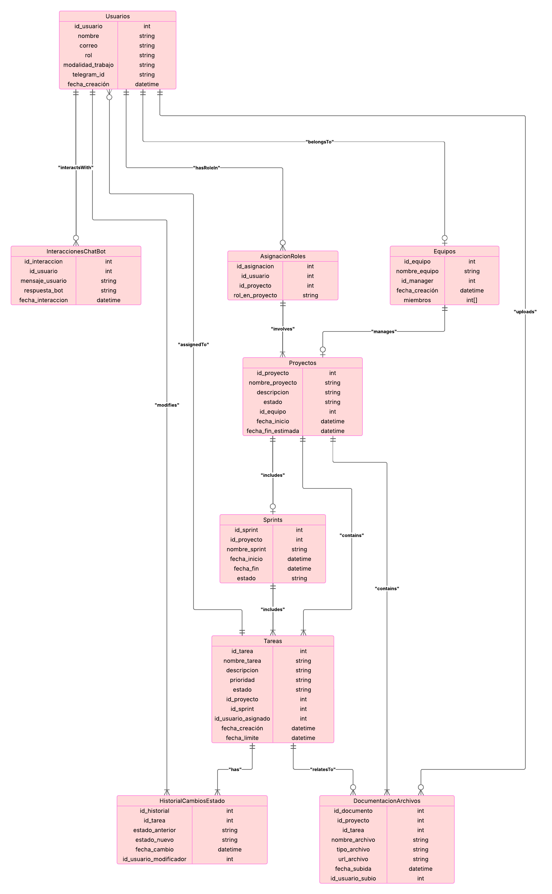

# ARC
ORACLE JAVA BOT

Pasos para correrlo

1- Clonar el repo
2- Copiar wallet dentro de backend
3- Abrir el proyecto en terminal, en carpeta de backend
4- Correr comando: cmd
4- Correr comando: containerImgGenerator sh

Abrir localhost:8080 y verificar si les corre el proyecto

* Si no les corre hay que ejecutar manualmente en terminal lo siguiente:

docker build -f Dockerfile --platform linux/amd64 -t proyectoARC .

docker run -d --name agilecontainer -p 8080:8080 proyectoARC

Diagrama de Entidad Relacion

